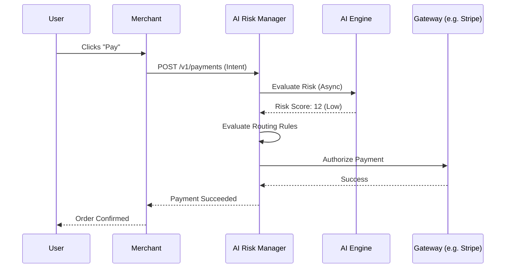

# Payment Workflow

```mermaid
sequenceDiagram
    participant User
    participant Merchant
    participant Router as AI Risk Manager
    participant AI as AI Engine
    participant PSP as Gateway (e.g. Stripe)
    
    User->>Merchant: Clicks "Pay"
    Merchant->>Router: POST /v1/payments (Intent)
    Router->>AI: Evaluate Risk (Async)
    AI-->>Router: Risk Score: 12 (Low)
    Router->>Router: Evaluate Routing Rules
    Router->>PSP: Authorize Payment
    PSP-->>Router: Success
    Router-->>Merchant: Payment Succeeded
    Merchant-->>User: Order Confirmed
```
