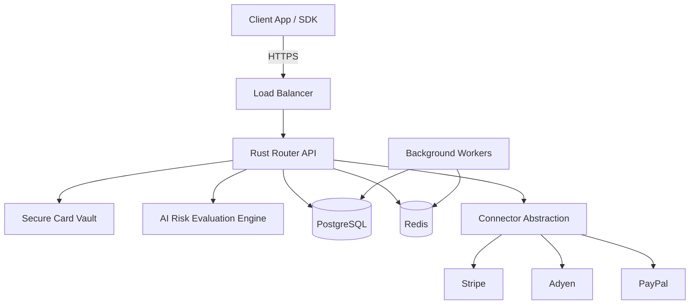

# System Architecture

## 1. Overview
The AI Risk Manager platform is built on a highly performant, microservices-oriented architecture using Rust for the core payment engine, PostgreSQL for persistent storage, and Redis for caching and queues.

## 2. Core Components

### Frontend (Merchant Dashboard)
- **Tech**: Next.js, React, Tailwind CSS.
- **Purpose**: Provides merchants with analytics, routing configuration, and fraud insights.

### Backend (Payment Router)
- **Tech**: Rust (Actix-web framework).
- **Purpose**: The high-throughput, low-latency core that handles API requests, validates inputs, and orchestrates calls to external gateways.

### Database Layer
- **Relational DB**: PostgreSQL (stores merchant configs, transaction metadata, routing rules).
- **Cache & Message Broker**: Redis (session management, rate limiting, distributed locking, background job queues).

### AI Fraud Module
- **Tech**: Python (FastAPI), PyTorch, XGBoost.
- **Purpose**: Asynchronous and synchronous evaluation of transaction risk using machine learning models.

### Secure Card Vault
- **Purpose**: A strictly isolated, PCI-compliant environment for tokenizing and storing sensitive cardholder data.

## 3. High-Level Diagram

## 4. Scalability & Load Balancing
- **Stateless Services**: All Rust API nodes are stateless, allowing horizontal scaling behind standard load balancers (e.g., AWS ALB).
- **Connection Pooling**: PgBouncer is utilized for efficient PostgreSQL connection management.

## 5. Monitoring & Logging
- **Traces**: OpenTelemetry integrated across all services.
- **Metrics**: Prometheus scraping runtime and business metrics.
- **Logs**: Promtail -> Loki -> Grafana for centralized, searchable logs.
