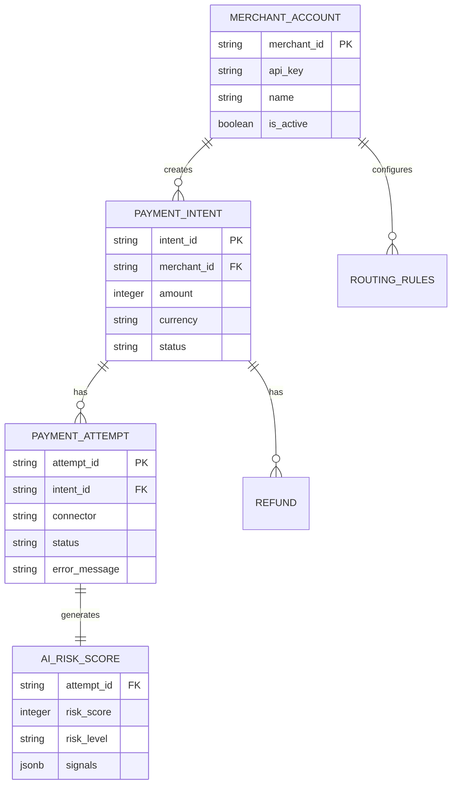

# Database Design

## 1. Overview
The PostgreSQL database is designed for high concurrency and relational integrity, managing merchant accounts, payment intents, and routing configurations.

## 2. Entity Relationship (ER) Diagram

## 3. Key Tables & Constraints
- **merchant_account**: Primary key `merchant_id`. Stores configuration and API credentials (hashed).
- **payment_intent**: Represents the lifecycle of a user's checkout session. Statuses: `requires_payment_method`, `processing`, `succeeded`, `failed`.
- **payment_attempt**: A single try against a specific payment processor. Includes the `connector` used and the `status`.

## 4. Indexing Strategy
- Heavy read queries (e.g., dashboard analytics) are supported by composite indexes on `merchant_id` + `created_at`.
- Lookups by external processor IDs are indexed to speed up webhook processing.

## 5. Data Privacy
- PII (Personally Identifiable Information) and PCI data are strictly segregated. Sensitive fields are encrypted at rest using AES-256-GCM.
